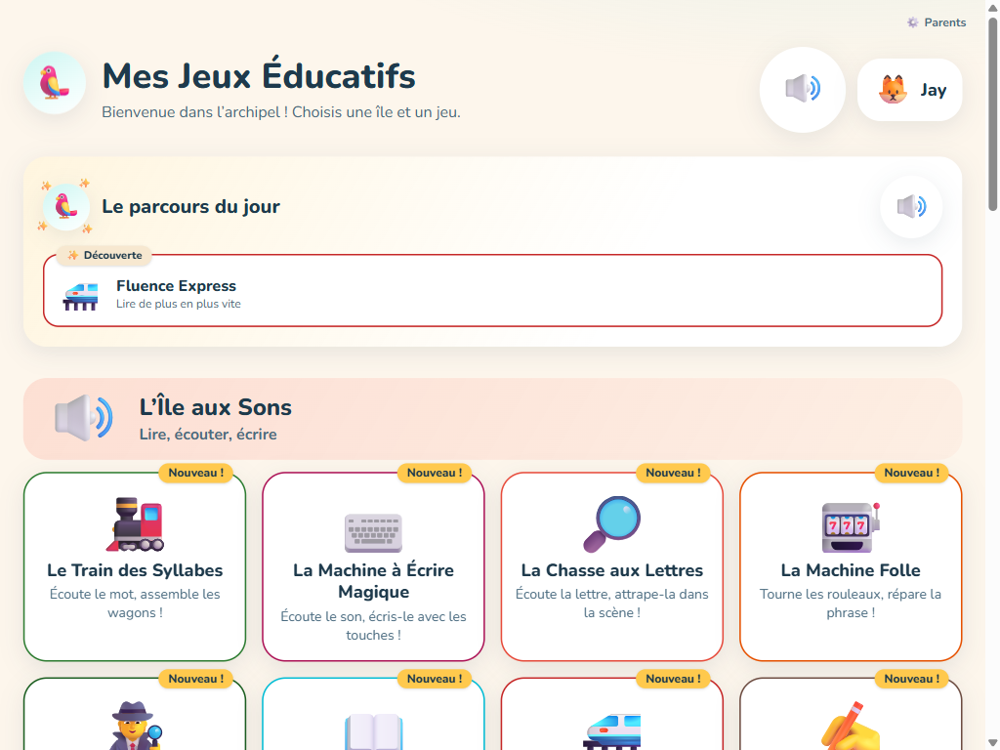
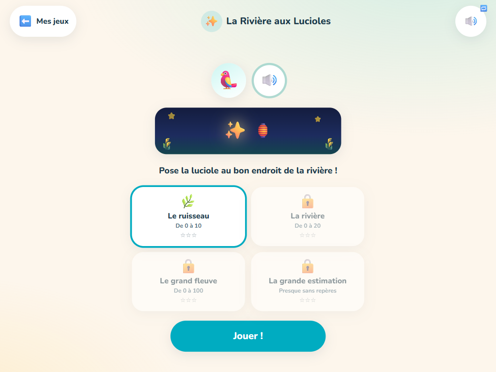
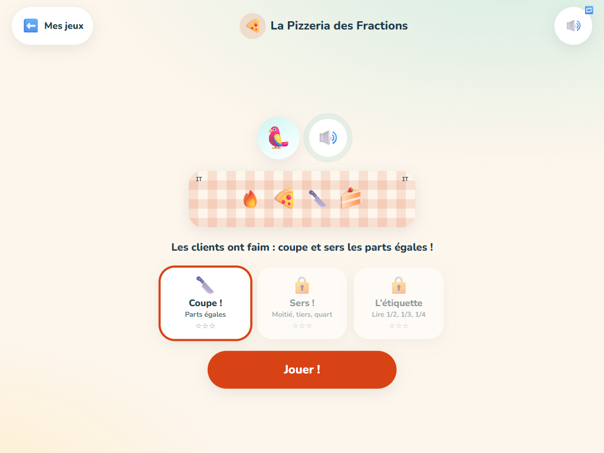

# Mes Jeux Éducatifs — L'Archipel

**24 jeux pour apprendre à lire, compter et raisonner, de la Grande Section au CE1.
100 % gratuits, zéro pub, zéro compte, zéro tracking, hors ligne — et alignés sur les
programmes officiels 2025 de l'Éducation nationale.**

🎮 **Jouer : [jeux.becausetimecounts.fr](https://jeux.becausetimecounts.fr/)**
· 🗺️ [Découvrir le projet](https://jeux.becausetimecounts.fr/decouvrir.html)
· 📖 [Notre méthode](https://jeux.becausetimecounts.fr/methode.html)
· 🩺 [Orthophonistes & enseignants](https://jeux.becausetimecounts.fr/orthophonistes.html)



---

## La case vide que ce projet occupe

L'état du marché (étude menée en 2026, détail dans [v2-proposition.md](v2-proposition.md)) :

- **Khan Academy Kids**, le standard mondial du gratuit sans pub, **n'existe qu'en
  anglais** — aucune version française prévue.
- **Lalilo est devenu payant** (fin du dispositif P2IA en août 2025) : il n'existe plus
  **aucun outil adaptatif gratuit** en France.
- **ANTON**, seul gratuit complet en français, reste documenté comme froid : exercices
  mécaniques type QCM, voix robotisées — et l'offline y est payant.
- Le gratuit historique vit de la **publicité**, avec une UX datée et zéro suivi.
- 80 % des applications utilisées par les 3-5 ans contiennent des **dark patterns**
  (étude JAMA Network Open, 2022).

Gratuit, sans pub, sans compte, voix naturelle, adaptatif local, hors ligne, aligné
programmes 2025 : **personne n'occupait cette position.** Elle est structurellement
inattaquable par les modèles publicitaires (qui veulent maximiser le temps d'écran)
comme par les payants (qui veulent des comptes) — parce que ce site n'a rien à vendre.

## Les 5 lois de game design (non négociables)

1. **Zéro QCM — le doigt fait la compétence.** L'enfant *produit* la réponse : il
   construit des nombres avec des barres de dix, assemble des wagons-syllabes, règle des
   aiguilles, trace des lettres cursives, coupe des pizzas en parts égales. Le hasard ne
   rapporte jamais de points.
2. **L'erreur enseigne — et c'est un spectacle, pas une sanction.** Jamais le mot
   « faux », jamais de game over : le train relit *vraiment* ce que tu as construit et
   déraille comiquement, les parts inégales oscillent sur une balance. Puis le jeu montre
   *pourquoi*, redonne un essai, et re-pose la notion plus tard. Indice automatique après
   deux échecs.
3. **Audio d'abord.** 1 650 consignes en voix française naturelle (TTS neuronal validé,
   plus une vraie voix britannique pour l'anglais), embarquées et précachées : un enfant
   de 4 ans qui ne sait pas lire est autonome de bout en bout. La phonologie est purement
   auditive — le mot n'est jamais affiché dans un jeu de sons.
4. **Le score est honnête ou n'existe pas.** Seuls les premiers essais alimentent la
   maîtrise. Pas de streaks, pas de classement, pas de « reviens demain » : l'effet de
   sur-justification détruit la motivation intrinsèque, on n'en veut pas.
5. **Chaque île contient un jouet.** Un mode création sans objectif ni score quelque
   part dans chaque univers : labyrinthes à construire pour faire jouer papa, pixel art
   libre avec export, séquenceur musical, bac à eau. La fierté de montrer est la
   récompense la plus saine.

## Les fondements scientifiques

Chaque choix de conception s'appuie sur les programmes officiels et la recherche :

- **Programmes 2025** (BO n°41 du 31 octobre 2024, en vigueur depuis la rentrée 2025) :
  les 75 compétences de la carte reprennent les libellés officiels — approche graphémique
  stricte au CP, attendus annuels et périodes P1-P5, 10 problèmes par semaine avec
  modélisation en barres (méthode de Singapour), nouveau domaine « motifs organisés » en
  maternelle (pré-algèbre), cibles de fluence chiffrées, fractions précoces au CE1.
- **Science de la lecture** (S. Dehaene, Graphogame) : décodage graphème par graphème au
  tempo officiel, encodage sous dictée sur clavier de graphèmes, discrimination auditive
  pure, confusions b/d/p/q retravaillées adaptativement.
- **L'estimation sur la droite numérique** est l'un des prédicteurs les plus robustes de
  la réussite mathématique : c'est un jeu entier (La Rivière aux Lucioles, du 0-10 au
  0-100 avec zoom progressif).
- **Les reprises anaphoriques** (comprendre qui se cache derrière « il » ou « elles »)
  prédisent la compréhension de lecture au CP : Mystères au Village en fait des enquêtes.
- **Répétition espacée à exposition variée** : une notion maîtrisée revient à J+2, J+7,
  J+21 (boîtes de Leitner), servie par un jeu *différent* à chaque fois — le mécanisme de
  consolidation le mieux validé.
- **Maîtrise mesurée honnêtement** : fenêtre glissante des 10 dernières réponses au
  premier essai, quatre états (découverte → en cours → maîtrisé → consolidé). Pas de
  boîte noire : simple, robuste, inspectable par les parents.
- **Repères écrans officiels** : sessions courtes, rituel de fin vers 15 minutes,
  recommandation d'accompagnement. Le site n'a aucun modèle économique qui pousse à
  rester.

## Les jeux

| | |
|---|---|
|  |  |

### L'Île aux Sons — lire, écouter, écrire

- **🚂 Le Train des Syllabes** — phonologie 100 % auditive : écoute le mot, scande-le au
  tambour, assemble les wagons… le train lit *vraiment* ce que tu as construit (et
  déraille comiquement sinon). Fusion, suppression, permutation de syllabes (GS 2025).
- **⌨️ La Machine à Écrire Magique** — encode sons, syllabes et mots sur un clavier de
  graphèmes (une touche = un son : « ch », « ou », « an »), au tempo graphémique du CP.
- **🔎 La Chasse aux Lettres** — la lettre est nommée à la voix, traquée dans des scènes
  fouillis en trois graphies dont la cursive ; b/d et p/q reviennent adaptativement.
- **🎰 La Machine Folle** — phrases cassées lues en gag : tourne les rouleaux pour
  réparer le sens et les accords (article-nom, sujet-verbe).
- **🕵️ Mystères au Village** — déplace l'étiquette IL/ELLE sur le bon personnage, élimine
  les suspects indice après indice : anaphores et inférences.
- **📖 Les Mots de la Semaine** — imagier parlant exploré *avant* le quiz (8 corpus
  thématiques officiels GS), puis attrape les mots et range-les par famille.
- **🚄 Fluence Express** — décodage chronométré tout en douceur : le mot n'est jamais
  prononcé avant la réponse, le train accélère comme récompense, jamais de chrono visible
  pour l'enfant. Mode duo : le parent chronomètre une lecture à voix haute (MCLM situé
  sur les repères 30/50/70).
- **✍️ La Lettre Magique** — tracé cursif au doigt avec guidage progressif (la fée trace,
  puis pointillés, puis tout seul) : boucles et ponts en GS, minuscules cursives au CP —
  la compétence jusqu'ici verrouillée par les applications payantes.

### L'Île aux Nombres — compter, calculer, payer

- **🪄 Les Gloutons du Dix** — des créatures voraces n'avalent que le compte exact :
  décompositions, compléments à 10 et doubles en puzzle physique.
- **🏗️ La Fabrique de Nombres** — barres de dix et cubes, avec la Machine qui casse une
  barre en 10 cubes (et soude l'inverse) : l'équivalence d'échange enfin manipulée.
- **🏪 Le P'tit Marchand** — des clients commandent à voix haute : paie le compte exact,
  rends la monnaie, et la boutique s'agrandit.
- **📊 Le Bar à Schémas** — problèmes en barres procéduraux, démarche en 4 phases (la
  prescription officielle des 10 problèmes/semaine).
- **🗺️ Calcul Aventure** — glisse les objets dans le panier puis tape le résultat au pavé.
- **⚖️ La Balance Magique** — équilibre les plateaux : l'égalité comme équivalence.
- **✨ La Rivière aux Lucioles** — estimation sur la droite numérique, de 0-10 à 0-100.
- **📦 Les Boîtes à Nombres** — subitizing, dénombrement, comparaison.
- **🍕 La Pizzeria des Fractions** — coupe en parts égales, sers « la moitié » (et
  découvre que c'est 2 parts sur 4), lis les étiquettes 1/2 et 3/4 (CE1 2025).

### L'Île des Robots — logique et petits programmes

- **🤖 Robo-Pilote** — programme le robot jusqu'au trésor : séquences, rotations, blocs
  « répéter ×N » rendus obligatoires par budget de coups — plus un atelier où l'enfant
  construit ses labyrinthes pour faire jouer les parents.
- **📿 Le Collier de Perles** — pose les perles, continue le motif (AB, AAB, ABC…),
  transcris-le en symboles : les « motifs organisés » du programme 2025.
- **🎨 L'Atelier Pixel** — copie, miroir (jusqu'au mandala), mémoire, dictée de
  coordonnées à la voix (« B3 en rouge ! ») et mode libre avec galerie et export PNG.

### L'Île du Monde — le temps, l'espace, la nature

- **🕰️ Le Grand Horloger** — place le soleil dans la journée, tourne la roue des jours,
  règle les aiguilles : heures piles, demies, mois et saisons.
- **💧 Le Laboratoire de l'Eau** — chauffe, gèle, fais voyager la goutte : les trois
  états et le cycle complet de l'eau, déclenchés par l'enfant (physique honnête : chaque
  action transforme vraiment la scène).

### L'Île d'Ailleurs — English, musique

- **🏝️ English Island** — imagier parlant en vraie voix britannique (colours, numbers,
  animals), ballons à éclater, animaux cachés et Simon Says à chaînes qui s'allongent.
- **🎵 L'Orchestre des Animaux** — écoute et rejoue les séquences (6 timbres synthétisés),
  puis prends la baguette : un séquenceur 8 temps pour composer et garder ses musiques.

### Les 5 jeux classiques (V1)

Sudoku des Petits, Le Plan de l'École, Le Restaurant des Animaux, Le Jardin des Émotions
et L'Atelier des Couleurs n'ont pas encore de refonte et restent servis tels quels.

## Pour les parents

- **Carte de compétences** : l'espace parents (derrière une petite multiplication) montre
  chaque attendu officiel colorié selon la maîtrise réelle, situé par rapport à la
  période en cours à l'école (P1-P5).
- **Fragilités détectées** : les notions sous 80 % de réussite au premier essai sont
  signalées, avec les jeux exacts pour les retravailler ensemble.
- **Fluence mesurée** : jauge MCLM sur les repères officiels 30/50/70 avec historique.
- **Parcours du jour** : trois activités suggérées (une fragile, une nouvelle, une
  révision) — une suggestion, jamais une contrainte.
- **Multi-profils** : chaque enfant de la fratrie a son profil et sa progression.
- **Vos données restent chez vous** : tout est en IndexedDB sur la tablette. Export et
  import JSON pour changer d'appareil. Aucun compte, aucun serveur, aucun cookie.

## Architecture technique

- **Vite + React 19 + TypeScript strict + Tailwind 4** — un moteur commun (audio,
  profils, maîtrise, répétition espacée Leitner, difficulté adaptative, scheduler du
  parcours du jour) écrit une fois et partagé par les 24 jeux.
- **1 117 tests** (vitest) : la logique de chaque jeu est pure et testée — générateurs
  procéduraux avec validateurs (solvabilité prouvée par BFS, unicité des solutions,
  distracteurs jamais ambigus). Plus jamais d'item impossible.
- **1 650 clips audio** pré-générés (edge-tts neuronal : Denise, Eloise, Henri, et Sonia
  pour l'anglais), précachés, avec fallback Web Speech.
- **102 pages SEO statiques** générées au build depuis la source unique
  (`games.manifest.ts` + `skill-map.ts`) : une page par jeu, une par compétence
  officielle, méthode, orthophonistes, sitemap.
- **PWA offline-first** : Workbox précache l'application entière, audio compris.
  Installable sur tablette et téléphone, fonctionne ensuite sans connexion.
- **Zéro backend, zéro coût** : GitHub Pages + Actions (Node 24). Le site peut tourner
  dix ans sans facture.

## Développer

```bash
pnpm install
pnpm dev        # serveur de dev
pnpm test       # 1117 tests (moteur + logique des jeux)
pnpm build      # typecheck + pages SEO + build production (Node ≥ 24)
pnpm audio      # régénère les clips TTS depuis les corpus (Python + edge-tts)
```

Ajouter un jeu : un dossier `src/games/<id>/` (composant + `logic.ts` pur testé +
`corpus.json`) et une entrée dans `src/games.manifest.ts` — la source unique qui génère
le hub, les routes, la carte de compétences et les pages SEO. Les contrats d'API et les
lois de game design sont dans [ENGINE.md](ENGINE.md).

**Contribuer sans coder** : les corpus (mots, imagiers, textes de lecture) sont des
fichiers de données — une PR de contenu suffit. Guide : [CONTRIBUTING.md](CONTRIBUTING.md).

## Feuille de route

- [v2-proposition.md](v2-proposition.md) — la refonte V2 (phases 0-4, **livrées** :
  audit des 29 jeux V1, étude de marché, moteur pédagogique, 24 jeux).
- [v3-proposition.md](v3-proposition.md) — le niveau supérieur (phases 5-7) : direction
  artistique illustrée (hybride IA + SVG riggé), refonte visuelle île par île, sound
  design organique, domaine dédié.

## Philosophie

- **Zéro tracking** — aucun analytics, aucun cookie, aucune donnée envoyée nulle part
- **Zéro pub** — jamais de publicité, jamais d'achat intégré
- **Zéro compte** — rien à créer, rien à configurer
- **Open source** — utilisez, modifiez, partagez

---

*Fait avec amour par un parent développeur pour ses enfants — et tous les autres.*
